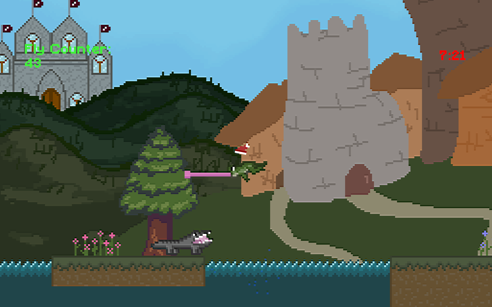
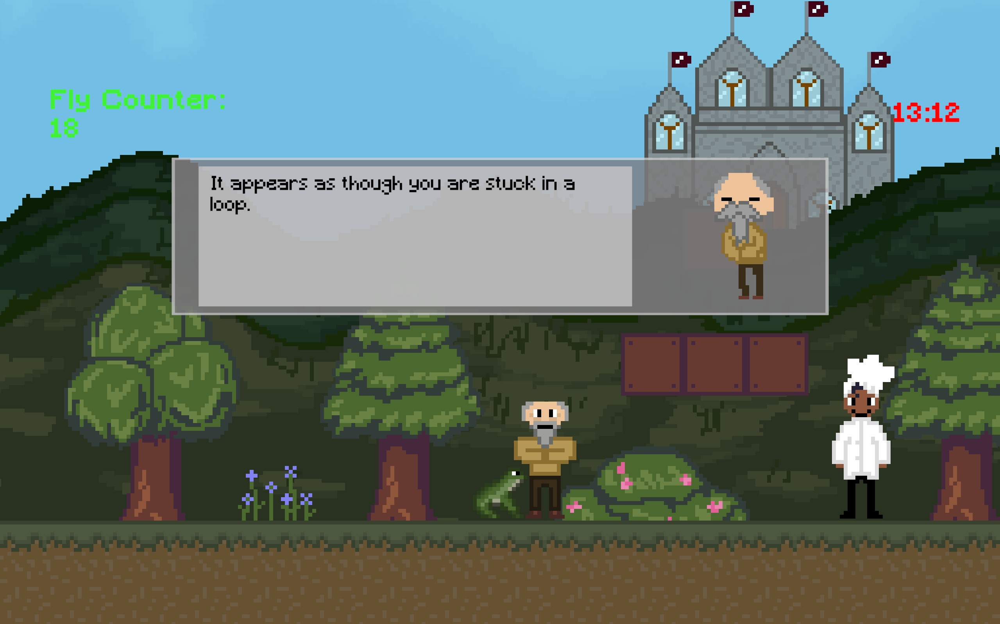
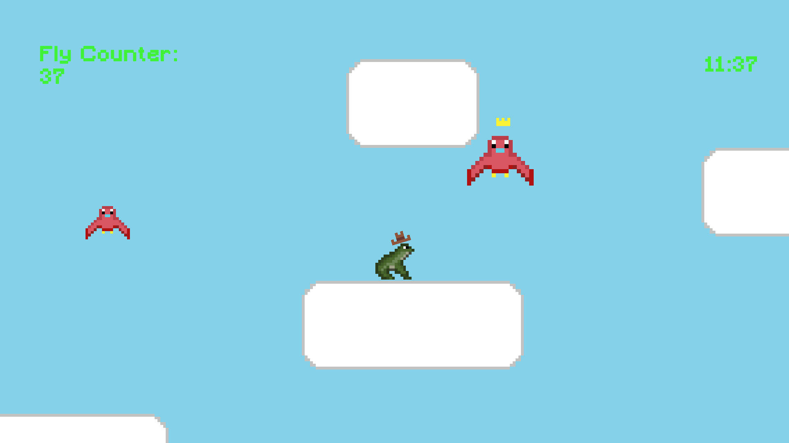
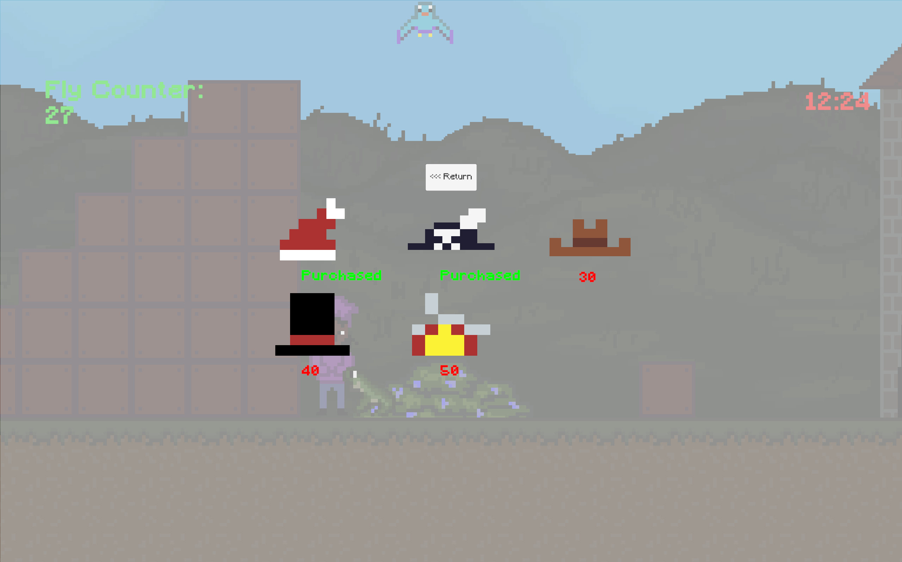

# Texas-Game-Jam-2025
Texas Game Jam hosted by EGADS from September 26th - September 28th 2025
Link: [Information Page](https://itch.io/jam/texas-game-jam-2025)

# Don't Croak
Playable Demo: [Play in Broswer](https://mray0256.itch.io/dont-croak)

## Screenshots

## Overview
A game created for the Texas Game Jam 2025. This project was developed within 48 hours and focuses on a Mario-esque platformer with narrative elements to fit the theme.

## Jam Theme
- "Out of Time"

## My Role
- Implemented enemy AI, in-game loop management, animations, and cutscenes
- Took the initiative to reach out to prospective team members and assemble a group of passionate college students

## Tech Stack
- Engine: Unity
- Language: C#, HLSL
- Tools: Aseprite

## Gameplay
A Mario-Esque platformer in which a player has been cursed as a frog and placed in a time loop! The player must defeat an evil wizard to escape and regain their humanity.

## What I Learned
- In a time-constrained environment, the fastest solution isn't always the most effective
  - Many systems were implemented using the simplest possible approaches while learning Unity during development, which later limited flexibility and introduced rework
- Core Unity concepts, including scripting, scene management, and animating
- Collaboration & leading under stress
- Making executive decisions when other team members lacked direction

## Future Improvements
Altough the game jam has concluded and the project will not be revisited, several areas could've been improved:
- Code organization and architecture (improved reuse, optimization, data-driven design)
- Graphical polish, including more shaders and unique assets
- Dialogue quality and clarity
- More varied gameplay to reduce reliance on fetch-style quests
